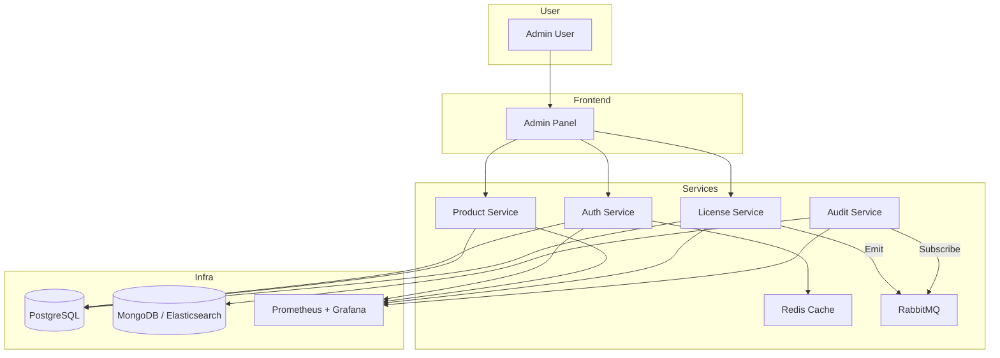

# 🧠 Licensify – Technology & System Architecture

## 🔧 Technology Stack

| Layer          | Tech Stack                                |
| -------------- | ----------------------------------------- |
| Frontend       | React + NextUI                            |
| Backend        | ASP.NET Core (.NET 8)                     |
| Database       | PostgreSQL                                |
| Cache          | Redis                                     |
| Message Broker | RabbitMQ                                  |
| Logging        | Serilog, MongoDB/Elasticsearch (optional) |
| DevOps         | Docker, Kubernetes, Helm, GitHub Actions  |
| Monitoring     | Prometheus, Grafana                       |

---

## 🧱 System Architecture

---

## 📦 Deployment Architecture

* All services are containerized using Docker.
* Each service has its own Helm chart for K8s deployment.
* Configuration managed via Secrets and ConfigMaps.
* GitHub Actions handles CI (build/test) and CD (deploy).
* PostgreSQL and Redis deployed as stateful workloads.
* Optional: External MongoDB or Elasticsearch if audit logging is enabled.

---

👊 This architecture supports modular scaling, observability, CI/CD, and is cloud-native by design. Ready for SaaS or self-hosted licensing.
